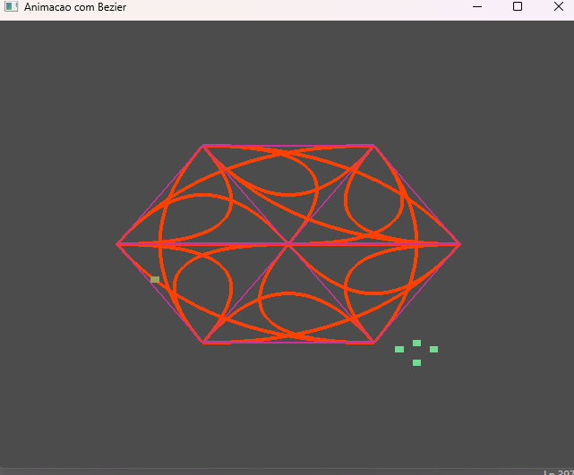

# Welcome to My Portfolio!

This is my personal portfolio site, built with **GitHub Pages**. Here, you'll find my latest projects, skills, and ways to get in touch. I'm a passionate developer, always eager to take on new challenges and explore new technologies!

## 🌐 Live Site

Check out the live portfolio here: [yourusername.github.io](https://yourusername.github.io)

## 🛠 Projects

Here are some of the projects I've worked on. You can find detailed descriptions and source code by exploring each repository:

### 1. **Project Name**
   - **Description**: A brief description of what the project is about, what technologies were used, and the challenges faced.
   - **Tech Stack**: HTML, CSS, JavaScript, etc.
   - **[Live Demo](https://link-to-project-demo.com)** | **[Source Code](https://github.com/yourusername/project-repo)**

### 2. **Project Name**
   - **Description**: Another great project with key features and technologies highlighted.
   - **Tech Stack**: Python, Django, etc.
   - **[Live Demo](https://link-to-project-demo.com)** | **[Source Code](https://github.com/yourusername/project-repo)**

### 3. **Project Name**
   - **Description**: Overview of the project, what you learned, and the value it adds.
   - **Tech Stack**: React, Node.js, etc.
   - **[Live Demo](https://link-to-project-demo.com)** | **[Source Code](https://github.com/yourusername/project-repo)**

## 📖 Skills

Here are some of the technologies and tools I frequently work with:

- **Languages**: JavaScript, Python, Java, C++
- **Web Development**: HTML, CSS, React, Node.js
- **Database**: MySQL, MongoDB
- **Tools**: Git, Docker, AWS

## 📫 Contact

I'm always open to new opportunities! Feel free to reach out via:

- **Email**: youremail@example.com
- **LinkedIn**: [Your LinkedIn Profile](https://linkedin.com/in/yourprofile)
- **GitHub**: [GitHub Profile](https://github.com/yourusername)

---

Created with ❤️ by [Your Name](https://github.com/yourusername)
